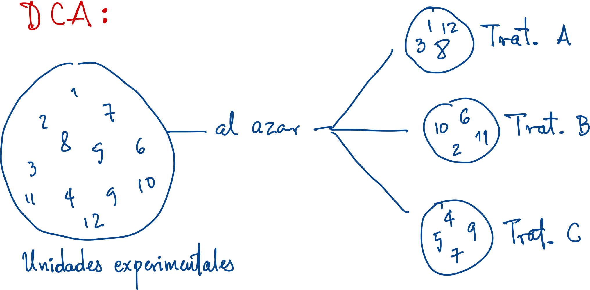
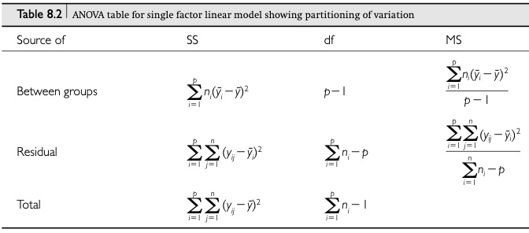
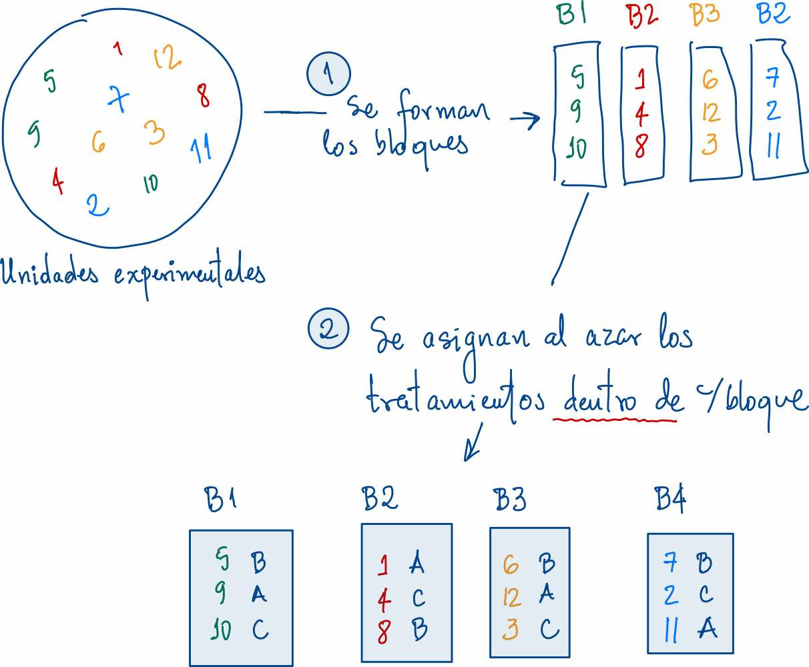
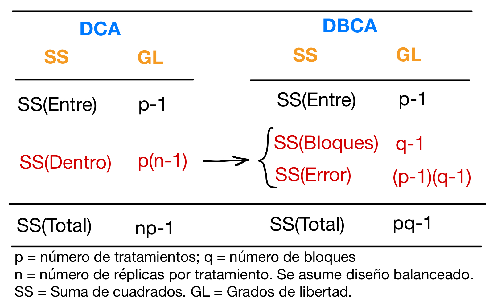
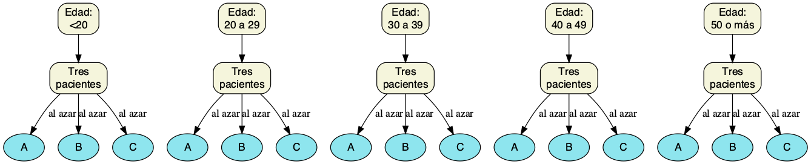

name: toc
class: inverse

```{css, echo = F}
.red { color: red; }

.big { font-size: 250% }
.large { font-size: 135% }
.small { font-size: 70% }
.tiny{font-size: 40%}
.larget {font-size: 22px; }

.remark-inline-code{
   background: #F5F5F5; /* lighter */
  /*  background: #e7e8e2; /* darker */
    border-radius: 1px;
  padding: 0.01px;
}

.remark-slide-number{
  font-size: 0.7em;
}

.remark-slide-content {
  font-size: 22px;
}

.remark-code {
  display: block;
  overflow-x: auto;
  padding: .5em;
  color: #333;
  background: #f8f8f8;
}

.footer {
    color: black;
    position: fixed;
    top: 95%;
    left: 0;
    text-align: center;
    width: 100%;
}
```


```{r, include = F}
library(knitr)
library(tidyverse)
library(kableExtra)
# library(xaringanthemer)
library(xaringanExtra)
library(janitor)
library(ggridges)
library(DiagrammeR)
library(DiagrammeRsvg)
library(rsvg)
library(cowplot)
library(formattable)
library(klippy)

# Codigo r y otras configuraciones
source('coder/devuelve_ruta.R')
ruta.antes <- devuelve_ruta(x = getwd())
```

```{r xaringanExtra, echo=FALSE}
xaringanExtra::use_xaringan_extra(c("tile_view"))
```

```{r xaringan-editable, echo=FALSE}
xaringanExtra::use_editable(expires = 1)
```

```{r xaringanExtra-clipboard, echo=FALSE}
xaringanExtra::use_clipboard(
    button_text = "Clic para copiar",
    success_text = "Copiado",
    error_text = "Pulse Ctrl + C para copiar"
  )
```

```{r, include = F}
# Opciones de chunks
opts_chunk$set(echo = F, fig.align = 'center', 
               warning = F, message = F, dev='svg',
               comment = '#>')
```

# Tabla de contenido

<br>

- [<h3>Glosorio</h3>](#glosario)

- [<h3>Dos diseños clásicos: DCA y DBCA</h3>](#dca-dbca)

- [<h3>Diseño completamento aleatorio (DCA)</h3>](#dca0)

- [<h3>Diseño en bloques completos al azar (DBCA)</h3>](#dbca0)

- [<h3>Extensión: Dos o más factores</h3>](#dosfac0)


---

name: glosario

# Glosario

.footer[[Regresar al contenido](#toc)]
---

template: glosario


- .orange[Experimento]: Escenario en el cual un investigador impone de forma deliberada un tratamiento a una muestra de "sujetos" para evaluar su respuesta al tratamiento.

--

- .orange[Diseño experimental]: aspectos inherentes a la organización de un experimento (variables respuesta, tratamientos, unidades experimentales, asignación de unidades a tratamientos y replicación). 

--

  .content-box-purple[
El .orange[Diseño experimental] busca crear condiciones tales que sólo se puedan plantear dos posibles explicaciones para el porqué la respuesta difiere entre los "sujetos": 
  * el tratamiento causó la diferencia, o
  * la diferencia sólo se debe a la variación del muestreo aleatorio.
]


---

template: glosario

- .orange[Respuesta]: Variable aleatoria cuya variación interesa estudiar o sobre la cual recaen las hipótesis de interés.

--

- .orange[Factor]: Variable (categórica) cuyos niveles definen los tratamientos o condiciones que se evaluaran para estudiar su efecto sobre la .orange[respuesta].

--

- .orange[Unidad experimental]: Entidad (sujeto, caja de petri, parcela, etc.) que se asigna a un tratamiento.

--

- .orange[Replicación]: Cuando hay más de una unidad experimental asignada a cada tratamiento. Permite estimar el .orange[error experimental].

--

- .orange[Error experimental]: Variación de la respuesta que ocurre entre unidades exp. tratadas de la misma forma (o están en el mismo tratamiento).

--

- .orange[Bloque]: Conjunto de unidades experimentales que tienen una o más características en común.


---

name: dca-dbca
layout: false

# Dos diseños clásicos: DCA y DBCA

<br>

.pull-left[  .full-width[
.content-box-purple[
### .orange[Diseño completamente aleatorio (DCA)]

Las unidades experimentales se reparten al azar entre los tratamientos.
]
]
]

--

.pull-right[ .full-width[
.content-box-purple[
### .orange[Diseño en bloques completos al azar (DBCA)]

Las unidades experimentales se agrupan en bloques y luego se reparten al azar entre los tratamientos, pero dentro de cada bloque.
]
]
]

.footer[[Regresar al contenido](#toc)]

---

name: dca0
class: middle inverse right
count: false

<h1>Diseño<br>completamente<br>aleatorio (DCA)</h1>


.footer[[Regresar al contenido](#toc)]

---

name: dca

# Diseño completamente aleatorio (DCA)


.footer[[Regresar al contenido](#toc)]

---

template: dca

<br>

```{r, out.width='80%'}

```


---

template: dca

## Asignación en un DCA

.pull-left[
```{r, echo = T}
library(tidyverse)
library(randomizr)
dca <- tibble(
  ue = 1:12,
  trat = complete_ra(
    N = 12, num_arms = 3, 
    conditions = c('T1', 'T2', 'T3'))
)

# UE's por trat:
xtabs(~ trat, data = dca)
```
]

.pull-right[
```{r, echo = T}
dca  # imprimir la tabla
```
]

---

template: dca
layout: true

## Análisis de datos en un DCA 

---


```{r}
grViz(
"digraph aov{
  graph[rankdir = TB]
  
node[fontname = Helvetica, shape = record, fontsize = 14,
     style = 'filled, rounded', fillcolor = 'darkorchid4', 
     penwidth = 0, fontcolor = white]  

A -> B -> {C D}

A[label = 'Prueba global:\\nAnálisis de varianza']
B[label = 'Comparaciones\\nentre medias']
C[label = 'Comparaciones\\nmúltiples']
D[label = 'Contrastes\\nplaneados']
}"
) %>% export_svg() %>% charToRaw() %>% 
  rsvg_png("images/analisis_dca.png")
```

```{r, out.width='50%'}
include_graphics('images/analisis_dca.png')
```


---

.left-column[
### Análisis de varianza

]

.right-column[
$$ H_0: \mu_1 = \mu_2 = \cdots = \mu_p $$

```{r, out.width='110%'}

```

]

---

name: dbca0
layout: false
class: middle inverse right
count: false

<h1>Diseño en<br>bloques completos<br>al azar (DBCA)</h1>

.footer[[Regresar al contenido](#toc)]
---

name: dbca

# Diseño en bloques completos al azar (DBCA)

.footer[[Regresar al contenido](#toc)]

---

template: dbca

<br>

Suponga que se quieren comparar $p$ grupos o tratamientos y se cuenta con un total de $pq$ unidades experimentales. Bajo un .orange[diseño en bloques completos al azar (DBCA)]:

--

- Se conforman .orange[grupos] de unidades experimentales (ue) que tengan al menos una característica en común. Cada grupo formado se llama .orange[bloque] y las características por las cuales se forman los bloques se les llama variables de bloqueo.

--

- Se forman $q$ bloques. En cada bloque se incluyen $p$ unidades experimentales. P.e., si hay $pq =12$ ue y se tienen $p = 3$ tratamientos, entonces el número de bloques debe ser $q = 12/p = 4$. 

--

- Los $p$ tratamientos se asignan al azar a las unidades .orange[dentro] de cada bloque.

---

template: dbca

<br>

```{r, out.width='70%'}

```


---

template: dbca

## Asignación en un DBCA

.pull-left[
```{r, echo = T}
library(tidyverse)
library(randomizr)
dbca <- tibble(
  ue = 1:12,
  bloque = c('B2', 'B4', 'B3', 'B2', 
             'B1', 'B3', 'B4', 'B2', 
             'B1', 'B1', 'B4', 'B3'),
  trat = block_ra(
    blocks = bloque, num_arms = 3, 
    conditions = c('T1', 'T2', 'T3'))
)

# UE's por trat:
xtabs(~ trat + bloque, data = dbca)
```
]

.pull-right[
```{r, echo = T}
 # imprimir la tabla
arrange(dbca, bloque) 
```
]

---

template: dbca
layout: true

## Análisis de datos en DBCA

---

- En términos macro es el mismo que para un DCA.

- En el .orange[DBCA], el término del error o residual se divide en dos: una variación debida a los bloques y otra para el error como tal.

```{r, out.width='65%'}

```

---

.left-column[
### Análisis de varianza

]

.right-column[

```{r, out.width='100%'}
include_graphics('images/anova_dbca.jpg')
```


]

---

template: dbca
layout: false
layout: true

## Análisis de datos en DBCA: Ejemplo

---

.pull-left[
Se compararon $p = 3$ métodos de enseñanza (A, B y C) de uso de un dispositivo prostético a pacientes que lo requieren. 

Dado que se piensa que la tasa de aprendizaje puede verse afectada por la edad de los pacientes, se utilizó la edad como un factor de bloqueo.
]


.pull-right[
```{r, out.width='90%'}
grViz(
" digraph { rankdir = LR

  node[shape = none, fontname = helvetica]
  {rank = same Edad Aprendizaje}
  Método -> Aprendizaje
  Edad -> Aprendizaje [color = dimgray]

Aprendizaje[fontcolor = darkorange1]
Edad[fontcolor = dimgray]
   
}"
)  %>% export_svg() %>% charToRaw() %>% 
  rsvg_png("images/tiempo_edad_metodo.png")

include_graphics('images/tiempo_edad_metodo.png')
```
]

---

Tres pacientes de cada uno de $q = 5$ grupos de edad fueron seleccionados para participar. 

Luego, cada paciente, dentro de cada grupo de edad, fue asignado al azar a uno de los tres métodos.

<br>


```{r, out.width='110%'}
grViz(
" digraph {
 
 graph[rankdir = TB]
 
 node[fontname = helvetica, style = 'filled, rounded', 
      fillcolor = beige, shape = box]
 
 G1 -> P1
 P1  -> {A1 B1 C1} [label = 'al azar']
 G2 -> P2 
 P2  -> {A2 B2 C2} [label = 'al azar']
 G3 -> P3
 P3  -> {A3 B3 C3} [label = 'al azar']
 G4 -> P4
 P4  -> {A4 B4 C4} [label = 'al azar']
 G5 -> P5
 P5  -> {A5 B5 C5} [label = 'al azar']
 
 P1[label = 'Tres\npacientes']
 P2[label = 'Tres\npacientes']
 P3[label = 'Tres\npacientes']
 P4[label = 'Tres\npacientes']
 P5[label = 'Tres\npacientes']
 
 G1[label = 'Edad:\\n<20']
 G2[label = 'Edad:\\n20 a 29']
 G3[label = 'Edad:\\n30 a 39']
 G4[label = 'Edad:\\n40 a 49']
 G5[label = 'Edad:\\n50 o más']
 
 A1[label = 'A', shape = ellipse, fillcolor = cadetblue2]
 A2[label = 'A', shape = ellipse, fillcolor = cadetblue2]
 A3[label = 'A', shape = ellipse, fillcolor = cadetblue2]
 A4[label = 'A', shape = ellipse, fillcolor = cadetblue2]
 A5[label = 'A', shape = ellipse, fillcolor = cadetblue2]
 A5[label = 'A', shape = ellipse, fillcolor = cadetblue2]
 
 B1[label = 'B', shape = ellipse, fillcolor = cadetblue2]
 B2[label = 'B', shape = ellipse, fillcolor = cadetblue2]
 B3[label = 'B', shape = ellipse, fillcolor = cadetblue2]
 B4[label = 'B', shape = ellipse, fillcolor = cadetblue2]
 B5[label = 'B', shape = ellipse, fillcolor = cadetblue2]
 B5[label = 'B', shape = ellipse, fillcolor = cadetblue2]
 
 C1[label = 'C', shape = ellipse, fillcolor = cadetblue2]
 C2[label = 'C', shape = ellipse, fillcolor = cadetblue2]
 C3[label = 'C', shape = ellipse, fillcolor = cadetblue2]
 C4[label = 'C', shape = ellipse, fillcolor = cadetblue2]
 C5[label = 'C', shape = ellipse, fillcolor = cadetblue2]
 C5[label = 'C', shape = ellipse, fillcolor = cadetblue2]
 
}
"
)  %>% export_svg() %>% charToRaw() %>% 
  rsvg_png("images/tiempo_dbca.png")


```

---

```{r, out.width='55%'}

```

```{r, echo = T}
# Se entran los datos
disp <- tibble(
  edad   = gl(n = 5, k = 3, 
              labels = c('<20', '20-29', '30-39', '40-49', '>50')),
  metodo = gl(n = 3, k = 1, length = 15,  labels = c('A', 'B', 'C')),
  tiempo = c(7,9,10, 8,9,10, 9,9,12, 10,9,12, 11,12,14)
)
```


---

.pull-left[
```{r, echo = T}
disp  # se imprime la tabla
```
]

.pull-right[
```{r, echo = T}
# Cantidad de UE's por 
# bloque y trat:
xtabs(~ metodo + edad, data = disp)
```
]

---

.pull-left[
```{r, echo = T, fig.show='hide'}
# Grafico exploratorio
ggplot(disp, aes(x = metodo, 
                 y = tiempo, 
                 group = edad,
                 color = edad)) +
  geom_point() + geom_path()
```


El aestetico `group` mapeado a la `edad` permite que `geom_path` trace líneas uniendo los puntos del mismo grupo de edad.

]


.pull-right[
```{r, echo = F, fig.width=3, fig.height=3.5}
# Grafico
ggplot(disp, aes(x = metodo, 
                 y = tiempo, 
                 group = edad,
                 color = edad)) +
  geom_point() + geom_path()
```
]

---


```{r, out.width='70%'}

```

---

```{r, echo = T}
# Analisis de varianza para el diseno en bloques:
m <- lm(tiempo ~ metodo + edad, data = disp)
anova(m)
```

---


```{r, echo = T}
# Analisis de varianza asumiendo un DCA:
m0 <- lm(tiempo ~ metodo, data = disp)
anova(m0)
```

---

```{r, echo = T}
24.9333 + 3.4667         # = 28.4 = SS del Error en el DCA
24.9333 / 28.4 * 100     # % del Error en el DCA debido a la edad  (=bloque)  
 3.4667 / 28.4 * 100     # % del Error en el DCA debido a otras cosas
```


---

```{r, echo = F, fig.width=4, fig.height=3.8, fig.cap='Distribución porcentual de la Suma de Cuadrados Total entre los dos diseños'}
SS0 <- prop.table( anova(m0)$'Sum Sq' )
SS0 <- c(SS0[1], 0, SS0[2])
SS  <- prop.table( anova(m)$'Sum Sq' )
mat <- rbind(DCA = SS0, DBCA = SS)
colnames(mat) <- c('metodo', 'edad\n(bloque)', 'error')
par(mar = c(3.5, 5, 1, 2.5), mgp = c(2,1,0), las = 1)
spineplot(mat[2:1, ], xlab = 'Diseño', ylab = NA, border = 'white',
          col = c('turquoise', 'rosybrown', 'tomato2' ))
```

---

template: dbca
layout: false

## Grados de libertad

.pull-left[
En un .orange[DBCA], los grados de libertad del error se reducen con respecto a un .orange[DCA]. Esto conlleva que el valor crítico de la $F$ sea mayor y por ende, sea más díficil rechazar $H_0$.

La ventaja del .orange[DBCA] se encuentra en que se espera que la varianza del error disminuya, y por tanto el valor calculado del $F$ sea más grande, como ocurrió con el ejemplo del tiempo de aprendizaje.
]


.pull-right[
```{r, fig.width=2.7, fig.height=5, out.width='66%'}
source('coder/sombra_dgen.R')
par(mfrow = c(2,1), mar = c(3.5, 1, 3, 1), mgp = c(2,1,0), cex = 0.9)
# para un DCA
qdca <- qf(p = 0.05, df1 = 2, df2 = 12, lower.tail = F)
area <- sombra.dgen(x0 = qdca, x1 = 7, fun = df, df1 = 2, df2 = 12)
curve(df(x, df1 = 2, df2 = 12), from = 0, to = 6, ylim = c(0,0.2),
      xaxt = 'n', main = 'DCA:\nF(2,12, alfa = 0.05) = 3.89',
      yaxt = 'n', ylab = NA)
polygon(area, col = 'orange')
axis(side = 1, at = c(0, round(qdca, 2)))
abline(v = qdca, lty = 2)

# para un DBCA
qdbca <- qf(p = 0.05, df1 = 2, df2 = 8, lower.tail = F)
area <- sombra.dgen(x0 = qdbca, x1 = 7, fun = df, df1 = 2, df2 = 8)
curve(df(x, df1 = 2, df2 = 8), from = 0, to = 6, ylim = c(0,0.2),
      xaxt = 'n', main = 'DBCA:\nF(2,8, alfa = 0.05) = 4.46',
      yaxt = 'n', ylab = NA)
polygon(area, col = 'orange')
axis(side = 1, at = c(0, round(qdbca, 2)))
abline(v = qdca, lty = 2)
```
]

---

template: dbca
layout: true

## Eficiencia relativa en la formación de bloques

---

Para medir que tan eficiente fue introducir la variable de bloqueo respecto a un DCA se puede calcular la **.orange[eficiencia relativa, RE]**, dada por:


$$ RE = \left( \dfrac{v_2 + 1}{(v_2 + 3)s^2_2} \right) \div \left( \dfrac{v_1 + 1}{(v_1 + 3)s^2_1} \right)  $$

donde el DCA es el 1 y el DBCA es el 2, $v_1$ y $v_2$ son los grados de libertad de los residuales de cada diseño, respectivamente. $s^2_1$ y $s^2_2$ son los cuadrados medios del error ( $MS_{res}$) de cada diseño respectivamente. En general se coloca en el numerador los datos del diseño que se considera más eficiente.

---

### Interpretación

- Si la RE $> 1$ el diseño 2 (con el bloqueo) fue mejor que el diseño 1 (sin bloque, bajo un esquema completamente aleatorizado).


- Si la RE $\leq 1$ el diseño 2 (con el bloqueo) no resultó más eficiente que el diseño 1.

---

### Cálculo en **R**

Se construyó esta [función o comando](https://raw.githubusercontent.com/paguzmang/funciones/master/er_bloques.R)  para realizar el cálculo de la ER.

```{r, echo = T, eval = F}
# Se carga script R con funcion para calcular ER
source('https://raw.githubusercontent.com/paguzmang/funciones/master/er_bloques.R')
er_bloques(m1 = m0, m2 = m)   # se aplica la funcion
```

```{r, echo = F}
# Se carga script R con funcion para calcular ER
# El archivo debe estar en el directorio de trabajo
source('coder/er_bloques.R')
er_bloques(m1 = m0, m2 = m)   # se aplica la funcion
```

---

template: dbca
layout: true

## Comparando medias

---

```{r, echo = T}
library(emmeans)
med <- emmeans(m, ~ metodo)   # Tabla de medias con error estandar + IC95%
med
```

---

```{r, echo = T}
library(emmeans)
med <- emmeans(m, specs = "metodo")   # Tabla de medias con error estandar + IC95%
med
```

---

```{r, echo = T}
contrast(med, method = "pairwise")   # Comparaciones multiples de Tukey
```

---

```{r, echo = T}
library(emmeans)
emmeans(m, specs =  "metodo", contr = 'pairwise')
```

---

.pull-left[
```{r, echo = T, fig.show='hide'}
# Grafico:
emmeans(m, ~ metodo) %>%
  plot(CIs = T, comparisons = T, 
       horizontal = F)
```

Las flechas rojas en el gráfico indican las comparaciones múltiples. Si las flechas rojas se solapan, no hay diferencias a un nivel $\alpha = 0.05$.

Los métodos A  y B no difieren, y ambos difieren de C.
]


.pull-right[
```{r, echo = F, fig.width=2.7, fig.height=3.2}
emmeans(m, ~ metodo) %>%
  plot(CIs = T, comparisons = T, horizontal = F)
```
]

---

template: dbca
layout: true

## Conclusión del ejemplo

---

.pull-left[

Luego de ajustar por la edad, el análisis de varianza indica que existen diferencias en el tiempo medio de aprendizaje por los tres métodos ( $F_{2,8} = 21.4$; valor $p = 0.0006$). 

]


.pull-right[
```{r, echo = F, fig.width=2.7, fig.height=3.2}
emmeans(m, ~ metodo) %>%
  plot(CIs = T, comparisons = T, horizontal = F)
```
]

---

.pull-left[

Por la prueba de comparaciones múltiples de Tukey no se lograron detectar diferencias entre los métodos A y B (valor $p = 0.367$), pero si entre los métodos A y C (valor $p = 0.0006$) y los métodos B y C (valor $p = 0.0034$). 

Si se busca lograr un menor tiempo de aprendizaje se debe usar alguno de los métodos A o B.


]


.pull-right[
```{r, echo = F, fig.width=2.7, fig.height=3.2}
emmeans(m, ~ metodo) %>%
  plot(CIs = T, comparisons = T, horizontal = F)
```
]

---

template: dbca
layout: true

## Ejercicio: Ganancia en peso de lechones

---


```{r, include=F,eval=F}
library(randomizr)
set.seed(1858)
lechones <- tibble(
  peso = sort( rep(seq(21,27,by = 2), each = 3) + 
    round(runif(n = 12, min = -0.99, max = 0.99),1) ),
  bloque = gl(n = 4, k = 3, labels = paste0("B", 1:4) ),
  trat   = block_ra(blocks = bloque, num_arms = 3, conditions = paste0("T", 1:3)),
  gad   =  round(0.9 + 0.03*I(peso-23) + rnorm(n = 12, sd = 0.9*0.005),3)
)
#ggplot(lechones, aes(x = trat, y = gad)) + geom_point() + facet_grid(~ bloque)
#m <- lm(gad ~ bloque + trat, data = lechones)
#anova(m)
#with(lechones, tapply(peso, bloque, mean))
write.csv(x = dplyr::select(lechones, -peso), 
          file = "datos/lechones.csv", quote = F, row.names = F)
```

Se quiere evaluar el efecto de tres tratamientos en la dieta sobre la ganancia en peso de lechones destetos. Para el ensayo se utilizaron  12 lechones. No obstante, los lechones fueron de pesos diferentes al inicio del ensayo y se piensa que el peso inicial de los mismos podría afectar la variable respuesta (ganancia), por tanto se crearon cuatro bloques de tres lechones c/u, donde los tres individuos dentro de cada bloque fueron de pesos iniciales muy similares. Luego, dentro de cada bloque se aleatorizaron los tratamientos a los tres individuos. Descargue los datos [aquí](datos/lechones.csv) y realice las siguientes actividades.


---

1. Realice una tabla de frecuencias de dos vías para verificar la distribución de los individuos en el ensayo.

2. Realice un gráfico exploratorio que permita revisar el efecto del bloque (formado por el peso inicial) y el tratamiento.

3. Realice un análisis de varianza que incluya el efecto del bloque y del tratamiento. Concluya.

4. Mida la eficiencia en la formación de bloques.

5. Si resulta pertinente, realice una prueba de comparaciones múltiples de Tukey.

---

name: dosfac0
layout: false
class: middle inverse right
count: false

<h1>Extensión:<br>Dos o más factores</h1>

.footer[[Regresar al contenido](#toc)]
---

name: dosfac

# Extensión: Dos o más factores

---

template: dosfac

<br>

Los ejemplos anteriores han considero un sólo factor con $p$ niveles (a diferencia del factor de bloque). En este caso, cada nivel es un tratamiento.

--

Cuando se busca evaluar más de un factor, cada uno con cierto número de niveles, cada tratamiento equivale a una .orange[combinación] particular de niveles de todos los factores.

---
template: dosfac

<br>

P.e., suponga que interesa evaluar el efecto de la luz (baja, media y alta) y del estrés (con y sin estrés) sobre el crecimiento de las plantulas de cierta especie.

--

La luz y el estrés son los factores, el primero con tres niveles y el segundo con dos niveles, de modo que resultan $3 \times 2 = 6$ tratamientos.


```{r}
tibble(
  "  " = "Estrés",
  " " = c('sin', 'con'),
  baja = paste(c('sin', 'con'), 'baja', sep = ':'),
  media = paste(c('sin', 'con'), 'media', sep = ':'),
  alta = paste(c('sin', 'con'), 'alta', sep = ':')
) %>% kable(format = 'html') %>%
  kable_styling(full_width = F) %>%
  row_spec(0, background = 'wheat') %>%
  column_spec(1:2, bold = T, background = 'wheat') %>%
  column_spec(3:5, background = 'orchid', color = 'white', bold = T) %>%
  add_header_above(c(" " = 1, " " = 1,  'Luz' = 3), background = 'wheat' ) %>%
  collapse_rows(columns = 1:2, valign = 'middle' )
```

---

template: dosfac

## Notación

Cuando hay dos o más factores, el .orange[tamaño] del experimento, dado por el número de tratamientos, puede ser encontrado multiplicando los niveles de cada factor. Por ejemplo:

--


- Si hay dos factores, cada uno con dos niveles, entonces habrán $2 \times 2 = 2^2 = 4$ tratamientos.

--

- Si hay tres factores, dos de ellos con dos niveles, y el otro con tres niveles, entonces, habrán $2 \times 2 \times 3 = 2^2 \times 3 = 12$ tratamientos.

--

Así, este tipo de experimentos .orange[factoriales], se acostumbra a nombrarse usando un producto de potencias de la forma: $a^g \times b^h$, que indicaría un factorial que tiene $g$ factores con $a$ niveles cada uno y $h$ factores con $b$ niveles cada uno.

---

template: dosfac

## Notación: Ejemplo

Si se organizó un experimento **factorial** $3^2 \times 2^2$, indique:

1. ¿Cuántos factores tiene?

 R/. .red[.can-edit[coloque aquí la respuesta]]

2. ¿Cuántos niveles tiene cada factor?

 R/. .red[.can-edit[coloque aquí la respuesta]]
 
3. ¿Cuántos tratamientos hay en total?

 R/. .red[.can-edit[coloque aquí la respuesta]]

---

template: dosfac

## Notación: Otro ejemplo

Si se organizó un experimento **factorial** $2^2 \times 4 \times 3$, indique:

1. ¿Cuántos factores tiene?

 R/. .red[.can-edit[coloque aquí la respuesta]]

2. ¿Cuántos niveles tiene cada factor?

 R/. .red[.can-edit[coloque aquí la respuesta]]
 
3. ¿Cuántos tratamientos hay en total?

 R/. .red[.can-edit[coloque aquí la respuesta]]


---

template: dosfac
layout: true

## Asignación de UE a tratamientos (DCA)

---

```{r, echo = T}
# Creacion manual de etiquetas para los tratamientos:
et.trat <- c("con-baja", "con-media", "con-alta", 
             "sin-baja", "sin-media", "sin-alta")

et.trat
```

---

```{r, echo = T}
# Creacion automatica de etiquetas para los tratamientos:
et.trat <- expand.grid(
  luz    = c('baja', 'media', 'alta'),
  estres = c('con', 'sin') 
  ) %>%
  mutate(
    trat = paste(estres, luz, sep = '-')
  ) %>% pull( trat )

et.trat
```


---

.pull-left[
```{r, echo = -1}
set.seed(4590)
# Asignacion de UE a trat
dca <- tibble(
  ue = 1:24,
  trat = complete_ra(
    N = 24, num_arms = 6, 
    conditions = et.trat) #<<
)
```
]

.pull-right[
```{r, echo = T}
dca ## imprime la tabla
```
]

---

.pull-left[
```{r, echo = -1}
set.seed(4590)
# Asignacion de UE a trat
dca <- tibble(
  ue = 1:24,
  trat = complete_ra(
    N = 24, num_arms = 6, 
    conditions = et.trat)
  ) %>%
  separate(
    col = trat,
    into = c('estres', 'luz'),
    sep = '-'
  )
```
]

.pull-right[
```{r, echo = T}
dca ## imprime la tabla
```
]

---

```{r, echo=T}
# Revisando como quedo la REPLICACION luego de la asignacion:
xtabs(~ estres + luz, data = dca) %>%
  addmargins()
```

---

Si algunas UE's se pierden durante el experimento, al final el diseño quedará .orange[desbalanceado]. Considere este ejemplo donde se perdieron tres UE's:

```{r}
dca1 <- sample_n(dca, 21)
```


```{r, echo=T}
# Revisando la REPLICACION al final del experimento:
xtabs(~ estres + luz, data = dca1) %>%
  addmargins()
```

---

template: dosfac
layout: true

## Asignación de UE a tratamientos (DBCA)

---

Continuando con el mismo ejemplo sobre el efecto de la luz y el estrés en una planta, suponga que las plantulas que usted usará en el experimento vienen de cinco parentales diferentes (etiquetados como: B456, B378, C798, C301 y C356). 

--

A usted particularmente no le interesan estos parentales, pero quisiera controlar este factor como una forma de reducir el error experimental, entonces usará el .orange[parental como un factor de bloqueo] y asignará los tratamientos de acuerdo a un .orange[DBCA].

--

Bajo un .orange[DBCA] con q = 5 bloques (= parentales), si el experimento tendrá p = 6 tratamientos, ¿cuántas UE's se requiere por bloque? 

.pull-right[ &#8594; .red[.can-edit[coloque aquí la respuesta]] ]

---

```{r, eval = F}
library(openxlsx)
set.seed(129)
tibble(
  parental = gl(n = 5, k = 6, 
                labels = c("B456", "B378", "C798", "C301", "C356")),
  plantulas = sample(paste0('p', 1:30))
) %>%
  write.xlsx(file = 'datos/parentales.xlsx')
```

.left-column[
Descargar archivo **.orange[parentales.xlsx]** desde  [**aquí**](datos/parentales.xlsx)

]

.right-column[
```{r, out.width='65%'}

```
]


---

```{r,echo=T,eval=F}
# Se importa la tabla desde excel
library(readxl)
dbca <- read_excel(path = 'parentales.xlsx')
dbca
```


```{r,echo=F}
# Se importa la tabla desde excel
library(readxl)
dbca <- read_excel(path = 'datos/parentales.xlsx')
dbca
```


---

```{r,echo=T}
# Se realiza la asignacion de tratamientos a las UE's
# dentro de bloques:
dbca <- dbca %>%
  mutate(
    trat = block_ra(blocks = parental, num_arms = 6, conditions = et.trat)
  ) %>%
  separate(
    col  = trat,
    into = c('estres', 'luz'),
    sep  = '-'
  )
```


---

.pull-left[
```{r, echo=TRUE}
dbca  # se imprima la tabla
```
]

--

.pull-right[
```{r, echo = T}
# Revisando la replicacion 
# despues de la asigancion
xtabs(~ estres + luz + parental, 
      data = dbca)
```
]

---

**.orange[Exportar]** la tabla con la asignación a otra hoja del mismo libro de Excel que contenia la identificación de los bloques y UE

```{r, echo=T, eval = F}
library(openxlsx)
wb <- loadWorkbook(file = 'parentales.xlsx')
addWorksheet(wb, sheetName = 'asignacion')
writeData(wb, sheet = 'asignacion', x = dbca)
saveWorkbook(wb, file = 'parentales2.xlsx', overwrite = T)
```


```{r}
library(openxlsx)
wb <- loadWorkbook(file = 'datos/parentales.xlsx')
addWorksheet(wb, sheetName = 'asignacion')
writeData(wb, sheet = 'asignacion', x = dbca)
saveWorkbook(wb, file = 'datos/parentales2.xlsx', overwrite = T)
```

---


```{r, out.width='55%'}

```


---

template: dosfac
layout: true

## Análisis de datos bajo DCA

---

<br>

--

Suponga un DCA bajo una estructura .orange[factorial] $3 \times 2$, donde el factor A tiene tres niveles ( $a_1, a_2, a_3$) y el factor B tiene dos niveles ( $b_1, b_2$). 

--

Los .orange[tratamientos] serían:

$$\begin{array}{c|cc}
    & b_1 & b_2 \\
\hline
a_1 & a_1:b_1 & a_1:b_2 \\
a_2 & a_2:b_1 & a_2:b_2 \\
a_3 & a_3:b_1 & a_3:b_2 \\
\end{array}$$


---

.left-column[
### .purple[Hipótesis]
]

.right-column[

$$\text{Sobre A} \left \lbrace \begin{array}{ll}
H_0: & \mu_{a_1} = \mu_{a_2} = \mu_{a_3} \\
H_1: & \text{Al menos dos medias difieren} \\
\end{array}\right.$$

<br>

$$\text{Sobre B} \left \lbrace \begin{array}{ll}
H_0: & \mu_{b_1} = \mu_{b_2} \\
H_1: & \mu_{b_1} \neq \mu_{b_2} \\
\end{array}\right.$$

<br>

$$\text{Sobre A:B} \left \lbrace \begin{array}{ll}
H_0: & \text{No existe interacción entre A y B} \\
H_1: & \text{Existe interacción entre A y B} \\
\end{array}\right.$$
]

---

.left-column[
### .purple[Hipótesis de interacción]
]

--

.right-column[
La .orange[interacción] entre dos factores, A y B, ocurre cuando el efecto de uno de ellos cambia entre los niveles del otro.

Para entender la interacción primero definamos las .orange[medias de celda] o .orange[medias de los tratamientos]:

$$\begin{array}{c|cc|c}
    &   &  & \text{Efecto de B en}\\
    &  b_1 & b_2 & \text{cada nivel de A}\\
\hline
a_1 & \mu_{11} & \mu_{12}  & \mu_{11} - \mu_{12}\\
a_2 & \mu_{21} & \mu_{22}  & \mu_{21} - \mu_{22}\\
a_3 & \mu_{31} & \mu_{32}  & \mu_{31} - \mu_{32}
\end{array}$$
]

---

.left-column[
<h3>.purple[Hipótesis de interacción]</h3>

]


.right-column[
La .orange[interacción] entre dos factores, A y B, ocurre cuando el efecto de uno de ellos cambia entre los niveles del otro. 

.orange[No hay] interacción entre A y B si:

$$\underbrace{\mu_{11} - \mu_{12}}_{\text{Efecto de B en } a_1} = \underbrace{\mu_{21} - \mu_{22}}_{\text{Efecto de B en } a_2} = \underbrace{\mu_{31} - \mu_{32}}_{\text{Efecto de B en } a_3}$$

.orange[Si hay] interacción entre A y B cuando al menos un par de dichos efectos son diferentes.
]

---

.left-column[
### .purple[Perfil de medias para identificar interacción entre dos factores]

]

--

.right-column[
```{r, fig.width=5, fig.height=2.6}
# Creacion de un conjunto de mu's SIN INTERACCION:
mu.sin.int <- tibble(
  int = 'Sin interacción',
  A  = c('a1', 'a2', 'a3'),
  b1 = c(5,  5+2,  5+2+2), 
  b2 = b1 + 4
) %>% pivot_longer(cols = b1:b2, names_to = 'B', values_to = 'mu')

# Creacion de un conjunto de mu's CON INTERACCION:
mu.con.int <- tibble(
  int = 'Con interacción',
  A  = c('a1', 'a2', 'a3'),
  b1 = c(5,    7,   9  ), 
  b2 = c(5+4,  7-3, 9+4)
) %>% pivot_longer(cols = b1:b2, names_to = 'B', values_to = 'mu')

# Se pegan las dos tablas
dat.int <- bind_rows(mu.sin.int, mu.con.int)

# Grafico: perfil de medias 
ggplot(dat.int, aes(x = B, y = mu, group = A, color = A)) +
  geom_point(size = 3) + geom_path() + facet_grid(~ fct_inorder(int) ) +
  theme(strip.text = element_text(face = 'bold', size = 14))
```
]

---

.left-column[
<h3>.purple[Perfil de medias para identificar interacción entre dos factores]</h3>

]

.right-column[
```{r, fig.width=5, fig.height=2.6}
# Grafico: perfil de medias 
ggplot(dat.int, aes(x = A, y = mu, group = B, color = B)) +
  geom_point(size = 3) + geom_path() + facet_grid(~ fct_inorder(int) ) +
  theme(strip.text = element_text(face = 'bold', size = 14))
```
]


---

.left-column[
<h3>.purple[Perfil de medias para identificar interacción entre dos factores]</h3>

]


.right-column[
```{r, echo = T}
# Creacion de un conjunto de mu's SIN INTERACCION:
mu.sin.int <- tibble(
  A        = c('a1', 'a2', 'a3'),
  b1       = c(5,  5+2,  5+2+2), 
  b2       = b1 + 4,
  efecto_B = b2 - b1
)
mu.sin.int
```
]

---

.left-column[
<h3>.purple[Perfil de medias para identificar interacción entre dos factores]</h3>
]


.right-column[
```{r, echo = T, highlight.output = c(4,5, 8,9)}
# Se convierten los datos a formato largo
mu.sin.int <- mu.sin.int %>% select(-efecto_B) %>%
  pivot_longer(cols = c(b1, b2), names_to = 'B', 
               values_to = 'mu')
mu.sin.int
```
]

---

.left-column[
<h3>.purple[Perfil de medias para identificar interacción entre dos factores]</h3>
]


.right-column[
```{r, echo = T, fig.width=3, fig.height=2.4}
# Grafico: perfil de medias (NO interaccion)
ggplot(mu.sin.int, aes(x = B, y = mu, group = A, color = A)) +
  geom_point(size = 3) + geom_path() + 
  labs(title = 'Sin interacción')
```
]

---

.left-column[
<h3>.purple[Perfil de medias para identificar interacción entre dos factores]</h3>
]


.right-column[
```{r, echo = T}
# Creacion de un conjunto de mu's CON INTERACCION:
mu.con.int <- tibble(
  A        = c('a1', 'a2', 'a3'),
  b1       = c(5,    7,   9  ), 
  b2       = c(5+4,  7-3, 9+4),
  efecto_B = b2 - b1
)
mu.con.int
```
]

---

.left-column[
<h3>.purple[Perfil de medias para identificar interacción entre dos factores]</h3>
]


.right-column[
```{r, echo = T, highlight.output = c(4,5, 8,9)}
# Se convierten los datos a formato largo
mu.con.int <- mu.con.int %>% select(-efecto_B) %>%
  pivot_longer(cols = c(b1, b2), names_to = 'B', 
               values_to = 'mu')
mu.con.int
```
]

---


```{r, include = F}
dat <- read_excel(path = 'datos/EXR_C08_S05_01.xlsx')
ggplot(dat, aes(x = Dose, y = Percent, color = Treat)) +
  geom_point( position = position_dodge(width = 2 ) ) +
  geom_smooth(method = 'lm', formula = y ~ x + I(x^2), se = F ) +
  scale_x_continuous(breaks = unique(dat$Dose) ) 

dat <- mutate(dat, DoseF = factor(Dose))
m <- lm(Percent ~ DoseF * Treat, data = dat )
anova(m)
emmeans(m, ~ DoseF) %>%
  contrast('poly')

emmeans(m, ~ Treat) %>% pairs()

m <- lm(Percent ~ Dose +  I(Dose^2) + Treat , data = dat )
anova(m)

ggplot(dat, aes(x = Treat, y = Percent)) +
  geom_point(  )

```


.left-column[
### .purple[Ejemplo]

Protección contra muerte célular
]


.right-column[

La muerte celular causada por un accidente cerebrovascular resulta parcialmente de la acumulación de altas concentraciones de glutamato. 

Se buscó determinar si diferentes dosis de troglitazone (1.3, 4.5 y 13.5 $\mu$M) y diferentes formas iónicas (- y +) del LY294002, un PI3-kinase inhibitor, podrían generar diferentes niveles de neuroprotección. 

]

---

.left-column[
<h3>.purple[Ejemplo]</h3>

Protección contra muerte célular

Descargue [aquí](datos/EXR_C08_S05_01.xlsx) los datos.

]


.right-column[

Cuatro ratas fueron estudiadas en cada combinación de dosis y forma iónica, y la respuesta registrada fue el porcentaje de muerte celular con relación a la muerte observada con glutamato. Entonces valores más altos de la respuesta implican menor neuroprotección. 

```{r, echo = T, eval = F}
# Lectura de datos
dat <- read_excel(path = 'EXR_C08_S05_01.xlsx')
str(dat)
```


```{r, echo = F}
# Lectura de datos
dat <- read_excel(path = 'datos/EXR_C08_S05_01.xlsx')
str(dat)
```

]

---

.left-column[
<h3>.purple[Ejemplo]</h3>

Protección contra muerte célular

]


.right-column[

```{r, echo = T}
# Se convierte la dosis en un factor
dat <- mutate(dat, DoseF = factor(Dose))
str(dat)
```

]

---

.left-column[
<h3>.purple[Ejemplo]</h3>

Protección contra muerte célular

]


.right-column[

```{r, echo = T}
# Revisamos la replicacion:
xtabs(~ Treat + DoseF, data = dat) %>% addmargins()
```

El diseño esta balanceado.


]

---

.pull-left[
<h3>.purple[Ejemplo]</h3>

```{r, echo = T, fig.show='hide'}
ggplot(dat, aes(x = Treat, 
                y = Percent)) +
  geom_boxplot() + 
  geom_jitter(width = 0.1, 
              height = 0)
```

]


.pull-right[


```{r, fig.width=3, fig.height=3.5}
ggplot(dat, aes(x = Treat, y = Percent)) +
  geom_boxplot() + geom_jitter(width = 0.1, height = 0)
```


]

---

.pull-left[
<h3>.purple[Ejemplo]</h3>

```{r, echo = T, fig.show='hide'}
ggplot(dat, aes(x = Dose, 
                y = Percent)) +
  geom_jitter(width = 0.1, 
              height = 0)
```

]


.pull-right[


```{r, fig.width=3, fig.height=3.5}
ggplot(dat, aes(x = Dose, 
                y = Percent)) +
  geom_jitter(width = 0.2, 
              height = 0)
```


]

---

.pull-left[
<h3>.purple[Ejemplo]</h3>

```{r, echo = T, fig.show='hide'}
ggplot(dat, aes(x = Dose, 
                y = Percent)) +
  geom_jitter(width = 0.1, 
              height = 0) +
  scale_x_continuous(
    breaks = c(1.3, 4.5, 13.5),
    limits = c(0, 15)
  )
```

]


.pull-right[


```{r, fig.width=3, fig.height=3.5}
ggplot(dat, aes(x = Dose, 
                y = Percent)) +
  geom_jitter(width = 0.2, 
              height = 0) +
  scale_x_continuous(
    breaks = c(1.3, 4.5, 13.5),
    limits = c(0, 15)
  )
```

]

---

.pull-left[
<h3>.purple[Ejemplo]</h3>

```{r, echo = T, fig.show='hide'}
ggplot(dat, aes(x = Dose, 
                y = Percent,
                color = Treat)) +
  geom_point(position = 
     position_dodge(width = 2)) +
  scale_x_continuous(
    breaks = c(1.3, 4.5, 13.5),
    limits = c(0, 15)
  )
```

]


.pull-right[


```{r, fig.width=4, fig.height=3.5}
ggplot(dat, aes(x = Dose, 
                y = Percent,
                color = Treat)) +
  geom_point(position = 
     position_dodge(width = 2)) +
  scale_x_continuous(
    breaks = c(1.3, 4.5, 13.5),
    limits = c(0, 15)
  )
```

]

---

.pull-left[
<h3>.purple[Ejemplo]</h3>

Medias de celda o de tratamientos:

```{r, echo = T}
medias <- dat %>%
  group_by(Treat, Dose) %>%
  summarise(
    Percent = mean(Percent)
  )
```

]


.pull-right[


```{r, echo = T}
medias
```

]

---

.pull-left[
<h3>.purple[Ejemplo]</h3>

Perfil de medias para explorar posibilidad de interacción

```{r, echo = T, fig.show='hide'}
ggplot(medias, aes(
  x = Dose, y = Percent,
  group = Treat, color = Treat)) +
  geom_point() + geom_path() + 
  scale_x_continuous(
    breaks = c(1.3, 4.5, 13.5),
    limits = c(0, 15)
  )
```

]


.pull-right[


```{r, fig.width=4, fig.height=3.5}
ggplot(medias, aes(
  x = Dose, y = Percent,
  group = Treat, color = Treat)) +
  geom_point() + geom_path() + 
  scale_x_continuous(
    breaks = c(1.3, 4.5, 13.5),
    limits = c(0, 15)
  )
```

]

---

<h3>.purple[Ejemplo: Análisis de varianza]</h3>

```{r, echo = T}
m <- lm(Percent ~ DoseF + Treat + DoseF:Treat, data = dat)
m <- lm(Percent ~ DoseF * Treat, data = dat)  # equivalente
anova(m)
```

---

<h3>.purple[Ejemplo: Modelo sin interacción]</h3>

```{r, echo = T}
m1 <- lm(Percent ~ DoseF + Treat, data = dat)
anova(m1)
```

---

.left-column[
<h3>.purple[Ejemplo]</h3>

Medias y comparación de medias desde el modelo sin interacción para el factor **Treat**

]


.right-column[


```{r, echo = T}
emmeans(m1, specs = "Treat", contr = "pairwise")
```

]

---

.left-column[
<h3>.purple[Ejemplo]</h3>

Medias y comparación de medias desde el modelo sin interacción  para el factor **DoseF**

]


.right-column[

```{r, echo = T}
emmeans(m1, specs = "DoseF", contr = "pairwise")
```

]

---

.left-column[
<h3>.purple[Ejemplo]</h3>

Generación de tabla de medias para graficación

]


.right-column[


```{r, echo = T}
med <- emmeans(m1, ~ DoseF + Treat)
med
```

]

---

.left-column[
<h3>.purple[Ejemplo]</h3>

Gráfico de tabla de medias con barras de error (IC95%): 

Código **R**

]


.right-column[


```{r, echo = T, fig.show='hide'}
ps <- position_dodge(0.3)
med %>% as.data.frame() %>%
  ggplot(aes(x = DoseF, y = emmean, group = Treat, 
             color = Treat)) +
  geom_point(position = ps, size = 2) + 
  geom_line(position = ps) +
  geom_errorbar(aes(ymin = lower.CL, ymax = upper.CL), 
                position = ps, width = 0.1)
```

]

---

.left-column[
<h3>.purple[Ejemplo]</h3>

Gráfico de tabla de medias con barras de error (IC95%):

**Gráfico**

]


.right-column[


```{r, echo = F, fig.width=4, fig.height=3}
ps <- position_dodge(0.3)
med %>% as.data.frame() %>%
  ggplot(aes(x = DoseF, y = emmean, group = Treat, 
             color = Treat)) +
  geom_point(position = ps, size = 2) + 
  geom_line(position = ps) +
  geom_errorbar(aes(ymin = lower.CL, ymax = upper.CL), 
                position = ps, width = 0.1)
```

]

---

.left-column[
<h3>.purple[Ejemplo]</h3>

Calculando la media de los niveles de **Treat** en cada **DoseF**


]


.right-column[


```{r, echo = T}
emmeans(m1, ~ Treat, by = "DoseF")
```

]

---

.left-column[
<h3>.purple[Ejemplo]</h3>

Calculando el efecto de **Treat** sobre la respuesta en cada **DoseF**


]


.right-column[


```{r, echo = T}
emmeans(m1, ~ Treat, by = "DoseF") %>%
  contrast(method = "pairwise")
```

.small[.orange[Note] que el efecto de **Treat** sobre la respuesta es el mismo en cada nivel de la **DoseF**. Esto es debido a que en el modelo no tenemos el término de **interacción**.]

]

---

template: dosfac
layout: true

## Ejercicio: Alga intermareal y herbívoros

---

En un experimento $2 \times 2$ se investigó como los hervíboros afectan la abundancia de plantas que habitan la zona intermareal de un área costera en Washington usando transplantes del alga roja _Mazzaella parksii_. El experimento también examinó si el efecto de los hervíboros sobre el alga depende de la altura o lugar (más arriba o más abajo) de la zona intermareal donde el alga esta creciendo.

Se utilizó como unidad experimental una **parcela**, con un total de 64 parcelas (del mismo tamaño). Treinta dos parcelas fueron ubicadas en la marca de la línea de marea baja, y las otras 32 fueron ubicadas en la mitad entre las marcas de marea baja y alta. 

```{r, include = F, eval = F}
library(abd)
abdData(chapters = 18)
str(IntertidalAlgae)
IntertidalAlgae %>%
  rename(
    altura = height,
    herbiv = herbivores,
    raiz2.area = sqrt.area
  ) %>%
  mutate(
    altura = fct_recode(altura, baja = "low", mitad = "mid"),
    herbiv = fct_recode(herbiv, aus = "minus", pres = "plus")
  ) %>%
write.csv(file = "datos/algaIntermareal.csv", row.names = F, quote = F)
```

```{r, include = F}
alga <- read.csv(file = "datos/algaIntermareal.csv")
```

---

Todas las parcelas se limpiaron de todos los organimos (algas y hervíboros). Luego, una cantidad constante de nueva alga (_M. parksii_) fue adeherida al suelo en el centro de cada parcela.

La mitad de las parcelas en cada altura fueron encerradas excluyendo a los herbívoros (lapas y caracoles principalmente), la otra mitad se dejaron abiertas a la presencia de herbívoros.

Al final se registró el área (en cm<sup>2</sup>) cubierta por el alga en cada parcela. Los datos del área fueron transformados con raíz cuadrada para mejorar el cumplimiento del supuesto de normalidad y homogeneidad de varianzas.

---

.left-column[

Descargue [aquí](datos/algaIntermareal.csv) los datos, importelos a **R** y explore la estructura de la tabla


]


.right-column[


```{r, echo = T, eval = F}
# Se importan los datos
alga <- read.csv(file = "algaIntermareal.csv")
str(alga)   # estructura de la tabla
```

```{r, echo = F}
str(alga)
```

]

---

.left-column[

Verifique la distribución de las filas entre los tratamientos mediante una tabla de frecuencias


]


.right-column[


```{r, echo = T}
# Tabla de frecuencias de dos vias:
xtabs(~ altura + herbiv, data = alga) %>% addmargins()
```

El factor `herbiv` (herbívoros) tiene niveles `aus` (ausente) y `pres` (presente), y el factor `altura` (intermareal) tiene niveles `baja` (en la línea de marea baja) y `mitad` (en la mitad entre las líneas de marea baja y alta).

]

---

Realice las siguientes actividades

.small[
1. Realice un gráfico exploratorio de todas las parcelas que permita evaluar la cobertura del alga en relación con los factores bajo estudio.

2. Calcule las medias de la cobertura algal por tratamiento. Con esto, realice un gráfico de perfil de medias para explorar la posibilidad de interacción.

3. Realice un análisis de varianza que incluya el efecto principal de cada factor y además la interacción entre los dos factores.  ¿Existe interacción entre el factor de herbívoros y el factor de altura? Reporte el valor $F$, los grados de libertad y el valor $p$ para la prueba de interacción. Concluya.

4. Reporte el coeficiente de variación del experimento calculado como la raíz cuadrada del cuadrado medio del error en el análisis de varianza dividido por la media general de la respuesta.

4. Desde el objeto del modelo, genere una tabla de medias de los tratamientos con errores estándar. Grafique esta tabla y describa el patrón de la interacción entre los factores.
]

---

.left-column[

Ayuda: 

Considere el siguiente código **R** como ayuda para el ejercicio.


]


.right-column[

```{r, echo = T, eval = F}
# Modelo Anova:
m <- lm(raiz2.area ~ herbiv * altura, data = alga)
anova(m)

# Medias por herbiv en cada altura
emmeans(m, ~ herbiv | altura)

# Comparaciones multiples entre medias de los 
# 4 tratamientos
emmeans(m, ~ herbiv + altura) %>% 
  contrast(method = "pairwise")

# Grafico de medias y comparaciones multiples
emmeans(m, ~ herbiv + altura) %>% 
  plot(comparisons = T, horizontal = F)  

# Grafico de medias por herbiv y comparaciones 
# dentro de altura
emmeans(m, ~ herbiv | altura) %>% 
  plot(comparisons = T, horizontal = F)  
```

]


---
layout: false
class:  inverse center middle

# Gracias !!


Esta presentación fue creada en **R** + **Rstudio** con el paquete [`xaringan`](https://github.com/yihui/xaringan)

El "chakra" viene de [remark.js](https://remarkjs.com/#1), [knitr](https://yihui.org/knitr/) y [R markdown](https://rmarkdown.rstudio.com/)


