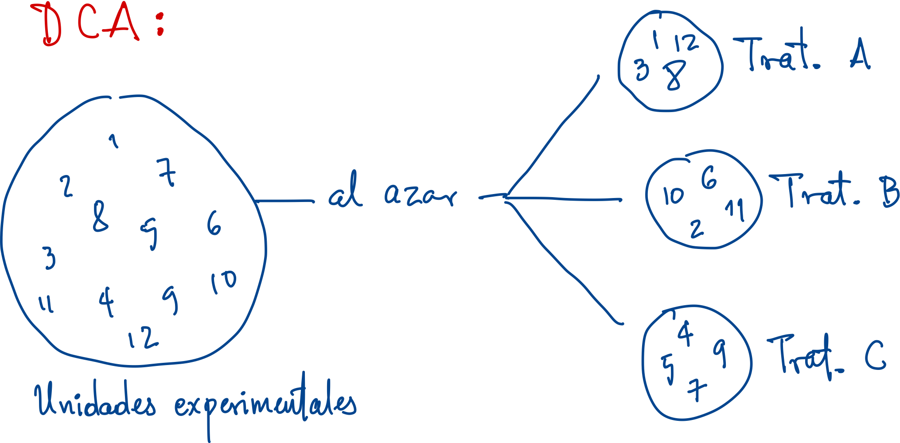
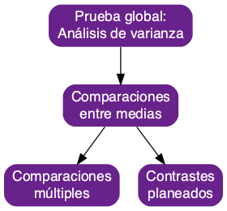
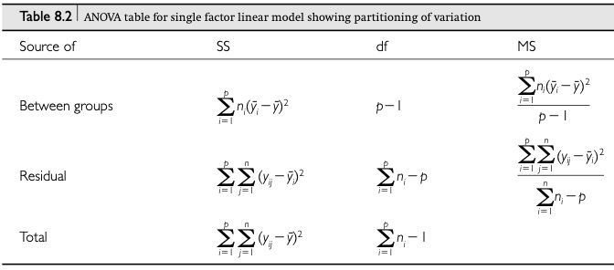
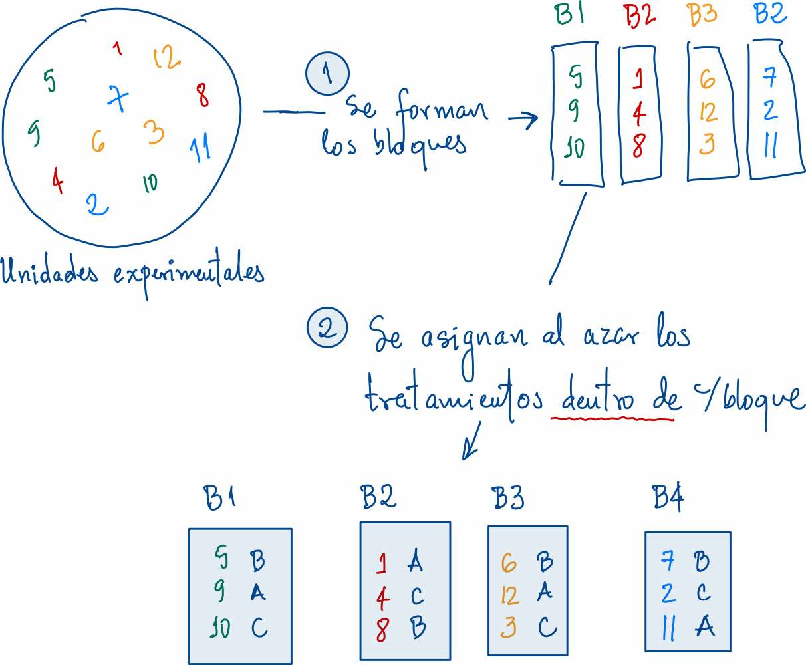
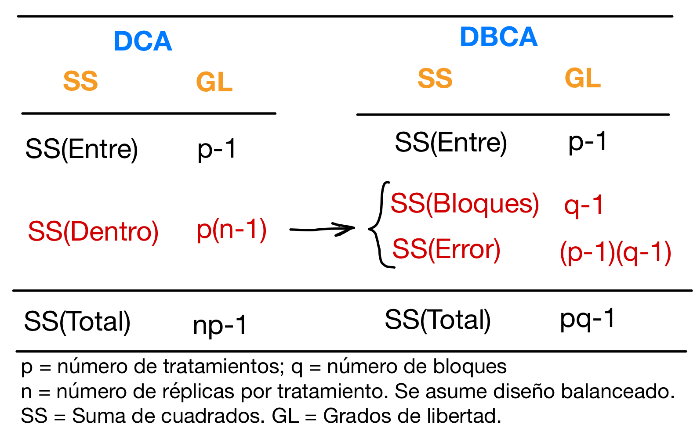
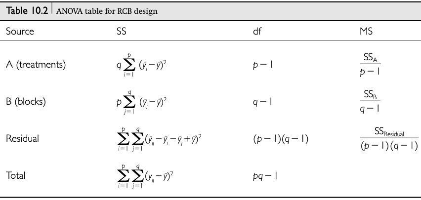
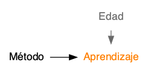
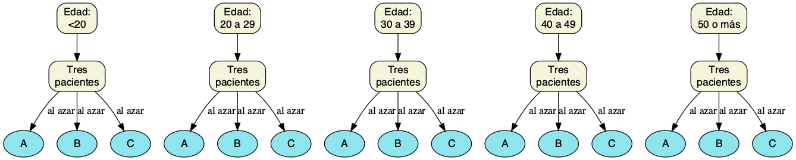

```{r setup, include=FALSE}
library(knitr)
knitr::opts_chunk$set(echo = F, fig.align = 'center', 
                      warning = F, message = F,
                      comment = '#>')
library(tidyverse)
library(kableExtra)
colFmt = function(x,color,outputFormat = 'html' ){
  # Funcion para colorear texto a discrecion en Rmarkdown
  # tomada de: https://stackoverflow.com/questions/29067541/how-to-change-the-font-color
  
  # outputFormat = knitr::opts_knit$get("rmarkdown.pandoc.to")
  if(outputFormat == 'latex')
    paste("\\textcolor{",color,"}{",x,"}",sep="")
  else if(outputFormat == 'html')
    paste("<font color='",color,"'>",x,"</font>",sep="")
  else
    x
}
cafe <- function(x) colFmt(x, color = 'brown')
```


# Glosario

---

<br>


- `r cafe('Experimento')`: Escenario en el cual un investigador impone de forma deliberada un tratamiento a una muestra de "sujetos" para evaluar su respuesta al tratamiento [@leblanc2004].

>- `r cafe('Diseño experimental')`: aspectos inherentes a la organización de un experimento (variables respuesta, tratamientos, unidades experimentales, asignación de unidades a tratamientos y replicación). 

>- El diseño experimental busca crear condiciones tales que sólo se puedan plantear dos posibles explicaciones para el porqué la respuesta difiere entre los "sujetos": (1) el tratamiento causó la diferencia, o (2) la diferencia sólo se debe a la variación del muestreo aleatorio [@leblanc2004].

---

<br>

- `r cafe('Respuesta')`: Variable aleatoria cuya variación interesa estudiar o sobre la cual recaen las hipótesis de interés.

>- `r cafe('Factor')`: Variable (categórica) cuyos niveles definen los tratamientos o condiciones que se evaluaran para estudiar su efecto sobre la `r cafe('respuesta')`.

>- `r cafe('Unidad experimental')`: Entidad (sujeto, caja de petri, parcela, etc.) que se asigna a un tratamiento.

>- `r cafe('Replicación')`: Cuando hay más de una unidad experimental asignada a cada tratamiento. Permite estimar el `r cafe('error experimental')`.

---

<br>

- `r cafe('Error experimental')`: Variación de la respuesta que ocurre entre unidades exp. tratadas de la misma forma (o están en el mismo tratamiento).

>- `r cafe('Bloque')`: Conjunto de unidades experimentales que tienen una o más características en común.


# Dos diseños clásicos:<br>DCA y DBCA

---

<br>
<br>

### `r cafe('Diseño completamente aleatorio (DCA)')`

Las unidades experimentales se reparten al azar entre los tratamientos.

### `r cafe('Diseño en bloques completos al azar (DBCA)')`

Las unidades experimentales se agrupan en bloques y luego se reparten al azar entre los tratamientos, pero `r cafe('dentro')` de cada bloque.

# Diseño completamente aleatorio (DCA)

---

<br>

```{r, out.width='80%'}

```

## Asignación en un DCA {.smaller}

<div style="float: left; width: 55%;">
```{r, echo = T}
library(tidyverse)
library(randomizr)
dca <- tibble(
  ue = 1:12,
  trat = complete_ra(
    N = 12, num_arms = 3, 
    conditions = c('T1', 'T2', 'T3'))
)

# UE's por trat:
xtabs(~ trat, data = dca)
```
</div>

<div style="float: right; width: 35%;">
```{r, echo = T}
dca  # imprimir la tabla
```
</div>

## Análisis de datos en un DCA {.flexbox  .vcenter}


```{r}
library(DiagrammeR)
library(DiagrammeRsvg)
library(rsvg)
grViz(
"digraph aov{
  graph[rankdir = TB]
  
node[fontname = Helvetica, shape = record, fontsize = 14,
     style = 'filled, rounded', fillcolor = 'beige']  

A -> B -> {C D}

A[label = 'Prueba global:\\nAnálisis de varianza']
B[label = 'Comparaciones\\nentre medias']
C[label = 'Comparaciones\\nmúltiples']
D[label = 'Contrastes\\nplaneados']
}"
) %>% export_svg() %>% charToRaw() %>% 
  rsvg_png("images/analisis_dca.png")
```

```{r, out.width='160%'}

```


## Análisis de datos en un DCA | **Análisis de varianza**

$$ H_0: \mu_1 = \mu_2 = \cdots = \mu_p $$

```{r, out.width='100%', fig.cap='Tomado de @quinn02'}

```

# Diseño en bloques completos al azar (DBCA)

---

Suponga que se quieren comparar $p$ grupos o tratamientos y se cuenta con un total de $pq$ unidades experimentales. Bajo un `r cafe('diseño en bloques completos al azar (DBCA)')`:

>- Se conforman `r cafe('grupos')` de unidades experimentales que tengan al menos una característica en común. Cada grupo formado se llama `r cafe('bloque')` y las características por las cuales se forman los bloques se les llama variables de bloqueo.

>- Se forman $q$ bloques. En cada bloque se incluyen $p$ unidades experimentales.
>- Los $p$ tratamientos se asignan al azar a las unidades `r cafe('dentro')` de cada bloque.
 
---

```{r, fig.width=5, fig.height=4}

```

## Asignación en un DBCA {.smaller}

<div style="float: left; width: 55%;">
```{r, echo = T}
library(tidyverse)
library(randomizr)
dbca <- tibble(
  ue = 1:12,
  bloque = c('B2', 'B4', 'B3', 'B2', 
             'B1', 'B3', 'B4', 'B2', 
             'B1', 'B1', 'B4', 'B3'),
  trat = block_ra(
    blocks = bloque, num_arms = 3, 
    conditions = c('T1', 'T2', 'T3'))
)

# UE's por trat:
xtabs(~ bloque + trat, data = dbca)
```
</div>

<div style="float: right; width: 35%;">
```{r, echo = T}
 # imprimir la tabla
arrange(dbca, bloque) 
```
</div>

## Análisis de datos en DBCA

- En términos macro es el mismo que para un DCA.

- En el `r cafe('DBCA')`, el término del error o residual se divide en dos: una variación debida a los bloques y otra para el error como tal.

```{r, out.width='65%'}

```


## Análisis de datos en DBCA | **Análisis de varianza**

```{r, out.width='100%', fig.cap='Tomado de @quinn02'}

```

---

<br>

- El DBCA garantiza que las unidades experimentales que son asignadas a tratamientos diferentes, sean similares (o iguales) respecto a la variable de bloqueo.

- De esta forma, se remueve (controla) el posible ruido originado por esta variable de bloqueo y se espera que la varianza residual o del error disminuya respecto a no incluirla en el diseño.


## Análisis de datos en DBCA | **Ejemplo: Aprendizaje de un dispositivo** {.flexbox .vcenter}


Se compararon $p = 3$ métodos de enseñanza (A, B y C) de uso de un dispositivo prostético a pacientes que lo requieren. Dado que se piensa que la tasa de aprendizaje puede verse afectada por la edad de los pacientes, se utilizó la edad como un factor de bloqueo [@daniel2013].


```{r, out.width='150%'}
grViz(
" digraph { rankdir = LR

  node[shape = none, fontname = helvetica]
  {rank = same Edad Aprendizaje}
  Método -> Aprendizaje
  Edad -> Aprendizaje [color = dimgray]

Aprendizaje[fontcolor = darkorange1]
Edad[fontcolor = dimgray]
   
}"
)  %>% export_svg() %>% charToRaw() %>% 
  rsvg_png("images/tiempo_edad_metodo.png")


```


---

<div style="float: left; width: 45%;">

**Ejemplo: Aprendizaje de un dispositivo**

Tres pacientes de cada uno de $q = 5$ grupos de edad fueron seleccionados para participar. 

Luego, cada paciente, dentro de cada grupo de edad, fue asignado al azar a uno de los tres métodos.
</div>

<div style="float: right; width: 45%;">
```{r, out.width='70%'}
grViz(
" digraph {
 
 graph[rankdir = LR]
 
 node[fontname = helvetica, style = 'filled, rounded', 
      fillcolor = beige, shape = box]
 
 G1 -> P1
 P1  -> {A1 B1 C1} [label = 'al azar']
 G2 -> P2 
 P2  -> {A2 B2 C2} [label = 'al azar']
 G3 -> P3
 P3  -> {A3 B3 C3} [label = 'al azar']
 G4 -> P4
 P4  -> {A4 B4 C4} [label = 'al azar']
 G5 -> P5
 P5  -> {A5 B5 C5} [label = 'al azar']
 
 P1[label = 'Tres\npacientes']
 P2[label = 'Tres\npacientes']
 P3[label = 'Tres\npacientes']
 P4[label = 'Tres\npacientes']
 P5[label = 'Tres\npacientes']
 
 G1[label = 'Edad:\\n<20']
 G2[label = 'Edad:\\n20 a 29']
 G3[label = 'Edad:\\n30 a 39']
 G4[label = 'Edad:\\n40 a 49']
 G5[label = 'Edad:\\n50 o más']
 
 A1[label = 'A', shape = ellipse, fillcolor = cadetblue2]
 A2[label = 'A', shape = ellipse, fillcolor = cadetblue2]
 A3[label = 'A', shape = ellipse, fillcolor = cadetblue2]
 A4[label = 'A', shape = ellipse, fillcolor = cadetblue2]
 A5[label = 'A', shape = ellipse, fillcolor = cadetblue2]
 A5[label = 'A', shape = ellipse, fillcolor = cadetblue2]
 
 B1[label = 'B', shape = ellipse, fillcolor = cadetblue2]
 B2[label = 'B', shape = ellipse, fillcolor = cadetblue2]
 B3[label = 'B', shape = ellipse, fillcolor = cadetblue2]
 B4[label = 'B', shape = ellipse, fillcolor = cadetblue2]
 B5[label = 'B', shape = ellipse, fillcolor = cadetblue2]
 B5[label = 'B', shape = ellipse, fillcolor = cadetblue2]
 
 C1[label = 'C', shape = ellipse, fillcolor = cadetblue2]
 C2[label = 'C', shape = ellipse, fillcolor = cadetblue2]
 C3[label = 'C', shape = ellipse, fillcolor = cadetblue2]
 C4[label = 'C', shape = ellipse, fillcolor = cadetblue2]
 C5[label = 'C', shape = ellipse, fillcolor = cadetblue2]
 C5[label = 'C', shape = ellipse, fillcolor = cadetblue2]
 
}
"
)  %>% export_svg() %>% charToRaw() %>% 
  rsvg_png("images/tiempo_dbca.png")


```
</div>

## Análisis de datos en DBCA | **Ejemplo: Aprendizaje de un dispositivo** {.smaller}

<div style="float: left; width: 58%;">
```{r, echo = T}
# Se entran los datos
disp <- tibble(
  edad   = gl(n = 5, k = 3, 
              labels = c('<20', '20-29', 
                         '30-39', '40-49', 
                         '>50')),
  metodo = gl(n = 3, k = 1, length = 15,  
              labels = c('A', 'B', 'C')),
  tiempo = c(7,9,10, 8,9,10, 9,9,12, 
             10,9,12, 11,12,14)
)

# Cantidad de UE's por bloque y trat:
xtabs(~ metodo + edad, data = disp)
```
</div>


<div style="float: right; width: 37%;">
```{r, echo = T}
disp  # se imprime la tabla
```
</div>

---

**Ejemplo: Aprendizaje de un dispositivo** 

<div style="float: left; width: 52%;">
```{r, echo = T, fig.show='hide'}
# Grafico exploratorio
ggplot(disp, aes(x = metodo, 
                 y = tiempo, 
                 group = edad,
                 color = edad)) +
  geom_point() + geom_path()
```
</div>


<div style="float: right; width: 43%;">
```{r, echo = F, fig.width=3, fig.height=3.5}
# Grafico
ggplot(disp, aes(x = metodo, 
                 y = tiempo, 
                 group = edad,
                 color = edad)) +
  geom_point() + geom_path()
```
</div>


---

<br>
<br>

```{r, out.width='70%'}

```

---

**Ejemplo: Aprendizaje de un dispositivo** 


```{r, echo = T, fig.show='hide'}
# Analisis de varianza
m <- lm(tiempo ~ metodo + edad, data = disp)
anova(m)
```

---

**Ejemplo: Aprendizaje de un dispositivo** 

```{r, echo = T, fig.show='hide'}
# Analisis de varianza (asumiendo un DCA)
m0 <- lm(tiempo ~ metodo, data = disp)
anova(m0)
```

---

**Ejemplo: Aprendizaje de un dispositivo** 

```{r, echo = T}
24.9333 + 3.4667         # = 28.4 = SS del Error en el DCA
24.9333 / 28.4 * 100     # % del Error en el DCA debido a la edad  (=bloque)  
 3.4667 / 28.4 * 100     # % del Error en el DCA debido a otras cosas
```


---

**Ejemplo: Aprendizaje de un dispositivo** 

```{r, echo = F, fig.width=4, fig.height=3.8, fig.cap='Distribución porcentual de la Suma de Cuadrados Total entre los dos diseños'}
SS0 <- prop.table( anova(m0)$'Sum Sq' )
SS0 <- c(SS0[1], 0, SS0[2])
SS  <- prop.table( anova(m)$'Sum Sq' )
mat <- rbind(DCA = SS0, DBCA = SS)
colnames(mat) <- c('metodo', 'edad\n(bloque)', 'error')
par(mar = c(3.5, 5, 1, 2.5), mgp = c(2,1,0), las = 1)
spineplot(mat[2:1, ], xlab = 'Diseño', ylab = NA, border = 'white',
          col = c('turquoise', 'rosybrown', 'tomato2' ))
```

## Grados de libertad en el DBCA {.smaller}


<div style="float: left; width: 52%;">

**Comparación de los grados de libertad del error entre un DCA y un DBCA**

En un `r cafe('DBCA')`, los grados de libertad del error se reducen con respecto a un `r cafe('DCA')`. Esto conlleva que el valor crítico de la $F$ sea mayor y por ende, sea más díficil rechazar H$_0$.

La ventaja del `r cafe('DBCA')` se encuentra en que se espera que la varianza del error disminuya, y por tanto el valor calculado del $F$ sea más grande, como ocurrió con el ejemplo del tiempo de aprendizaje.
</div>


<div style="float: right; width: 40%;">
```{r, fig.width=2.7, fig.height=5.5, out.width='76%'}
source('coder/sombra_dgen.R')
par(mfrow = c(2,1), mar = c(3.5, 1, 3, 1), mgp = c(2,1,0), cex = 0.9)
# para un DCA
qdca <- qf(p = 0.05, df1 = 2, df2 = 12, lower.tail = F)
area <- sombra.dgen(x0 = qdca, x1 = 7, fun = df, df1 = 2, df2 = 12)
curve(df(x, df1 = 2, df2 = 12), from = 0, to = 6, ylim = c(0,0.2),
      xaxt = 'n', main = 'DCA:\nF(2,12, alfa = 0.05) = 3.89',
      yaxt = 'n', ylab = NA)
polygon(area, col = 'orange')
axis(side = 1, at = c(0, round(qdca, 2)))
abline(v = qdca, lty = 2)

# para un DBCA
qdbca <- qf(p = 0.05, df1 = 2, df2 = 8, lower.tail = F)
area <- sombra.dgen(x0 = qdbca, x1 = 7, fun = df, df1 = 2, df2 = 8)
curve(df(x, df1 = 2, df2 = 8), from = 0, to = 6, ylim = c(0,0.2),
      xaxt = 'n', main = 'DBCA:\nF(2,8, alfa = 0.05) = 4.46',
      yaxt = 'n', ylab = NA)
polygon(area, col = 'orange')
axis(side = 1, at = c(0, round(qdbca, 2)))
abline(v = qdca, lty = 2)
```
</div>

## Eficiencia relativa de la formación de bloques {.smaller}

Para medir que tan eficiente fue introducir la variable de bloqueo respecto a un DCA se puede calcular la **`r cafe('eficiencia relativa, RE')`**, dada por:


$$ RE = \left( \dfrac{v_2 + 1}{(v_2 + 3)s^2_2} \right) \div \left( \dfrac{v_1 + 1}{(v_1 + 3)s^2_1} \right)  $$

donde el DCA es el 1 y el DBCA es el 2, $v_1$ y $v_2$ son los grados de libertad de los residuales de cada diseño, respectivamente. $s^2_1$ y $s^2_2$ son los cuadrados medios del error (MS$_{res}$) de cada diseño respectivamente. En general se coloca en el numerador los datos del diseño que se considera más eficiente.

## Eficiencia relativa de la formación de bloques | **Interpretación**

<br>

- Si la RE $> 1$ el diseño 2 (con el bloqueo) fue mejor que el diseño 1 (sin bloque, bajo un esquema completamente aleatorizado).


- Si la RE $\leq 1$ el diseño 2 (con el bloqueo) no resultó más eficiente que el diseño 1.


## Eficiencia relativa de la formación de bloques | **Cálculo en R**

Se construyó una [función o comando](coder/er_bloques.R) personalizado para realizar el cálculo de la ER.

```{r, echo = T, eval = F}
# Se carga script R con funcion para calcular ER
# El archivo debe estar en el directorio de trabajo
source('er_bloques.R')
er_bloques(m1 = m0, m2 = m)   # se aplica la funcion
```

```{r, echo = F}
# Se carga script R con funcion para calcular ER
# El archivo debe estar en el directorio de trabajo
source('coder/er_bloques.R')
er_bloques(m1 = m0, m2 = m)   # se aplica la funcion
```

## Comparando medias en el DBCA {.smaller}


```{r, echo = T}
library(emmeans)
emmeans(m, ~ metodo, contr = 'pairwise')
```


## Comparando medias en el DBCA {.smaller}


<div style="float: left; width: 52%;">
```{r, echo = T, fig.show='hide'}
# Grafico:
emmeans(m, ~ metodo) %>%
  plot(CIs = T, comparisons = T, 
       horizontal = F)
```

Las flechas rojas en el gráfico indican las comparaciones múltiples. Si las flechas rojas se solapan, no hay diferencias a un nivel $\alpha = 0.05$.

Los métodos A  y B no difieren, y ambos difieren de C.

</div>


<div style="float: right; width: 40%;">
```{r, echo = F, fig.width=2.7, fig.height=3.2}
emmeans(m, ~ metodo) %>%
  plot(CIs = T, comparisons = T, horizontal = F)
```
</div>

# Extensión:<br>Dos o más factores

## Dos o más factores

>- Los ejemplos anteriores han considero un sólo factor con $p$ niveles. En este caso, cada nivel es un tratamiento.

>- Cuando se busca evaluar más de un factor, cada uno con un cierto número de niveles, cada tratamiento equivale a una combinación particular de niveles de todos los factores.


## Referencias {.smaller}


